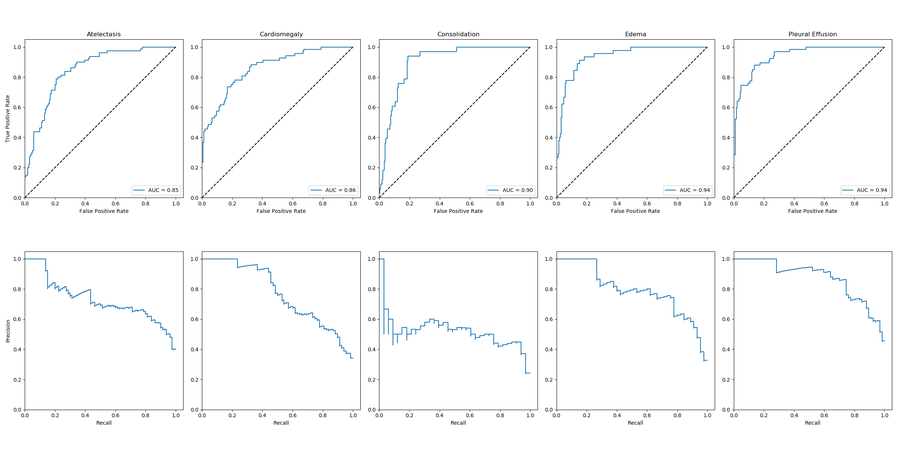

# CheXpert

Implementation of classification models on the [CheXpert dataset](https://stanfordmlgroup.github.io/competitions/chexpert/) aiming to replicate the results in [CheXpert: A Large Chest Radiograph Dataset with Uncertainty Labels and Expert Comparison](https://arxiv.org/abs/1901.07031).

### Usage

To train a model using default batch size, learning:
```
python chexpert.py  --train
                    --data_path         # location of dataset
                    --model             # choice of densenet121 or resnet152
                    --pretrained        # flag if pretrained model should be downloaded
                    --cuda              # number of cuda device to train on
                    --eval_interval     # how often to save model checkpoints, visualize and plot results
```

To evaluate a single model:
```
python chexpert.py  --evaluate_single_model
                    --model             # choice of densenet121 or resnet152 of the saved model
                    --data_path         # location of dataset
                    --output_dir        # folder where experiment results are saved
                    --restore           # filename relative to output_dir of the saved model checkpoint
                    --plot_roc          # flag to also plot ROC and PR
```

To evaluate an ensemble:
```
python chexpert.py  --evaluate_ensemble
                    --model             # choice of densenet121 or resnet152 of the saved model
                    --data_path         # location of dataset
                    --output_dir        # folder where experiment results are saved
                    --restore           # folder relative to output_dir where checkpoints are saved
                    --plot_roc          # flag to also plot ROC and PR
```

### Results

Models were trained with the hyperparameters described in the paper (Training Procedure section). Pretrained refers to ImageNet pretraining and subsequent fine-tuning of the entire model. The results below are an ensemble of the 10 best checkpoints on the validation set computing the mean of the output scores over the 10 models.

##### AUCROC scores on the validation set using U-Ones uncertainty labels:

| Model | Atelectasis | Cardiomegaly | Consolidation | Edema | Pleural Effusion |
| --- | --- | --- | --- | --- | --- |
| densenet121_baseline | 0.847 | 0.845	| 0.912 | 0.905 | 0.938 |
| densenet121_pretrained | 0.847 | 0.859 | 0.900 | 0.936 | 0.940 |
| resnet152_baseline | 0.861 | 0.852 | 0.908 | 0.894 | 0.919 |
| resnet152_pretrained | 0.849 | 0.859 | 0.916 | 0.934 | 0.944 |

##### ROC and PR plots on the validation set using DenseNet121_pretrained:




### Dependencies
* python 3.5+
* pytorch 1.0+
* torchvision
* numpy
* pandas
* sklearn
* matplotlib
* tensorboardX
* tqdm
