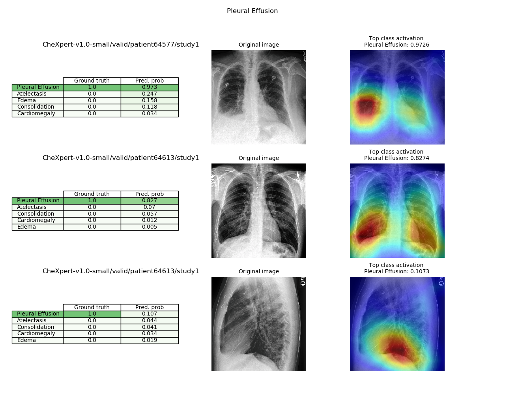
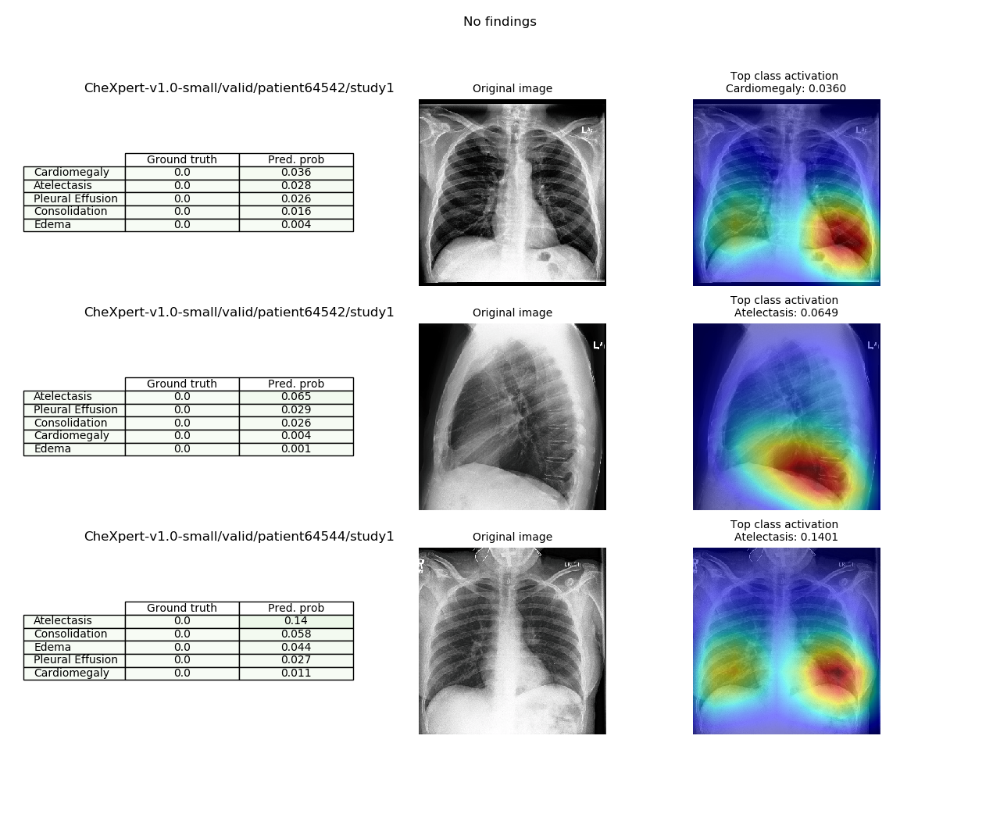
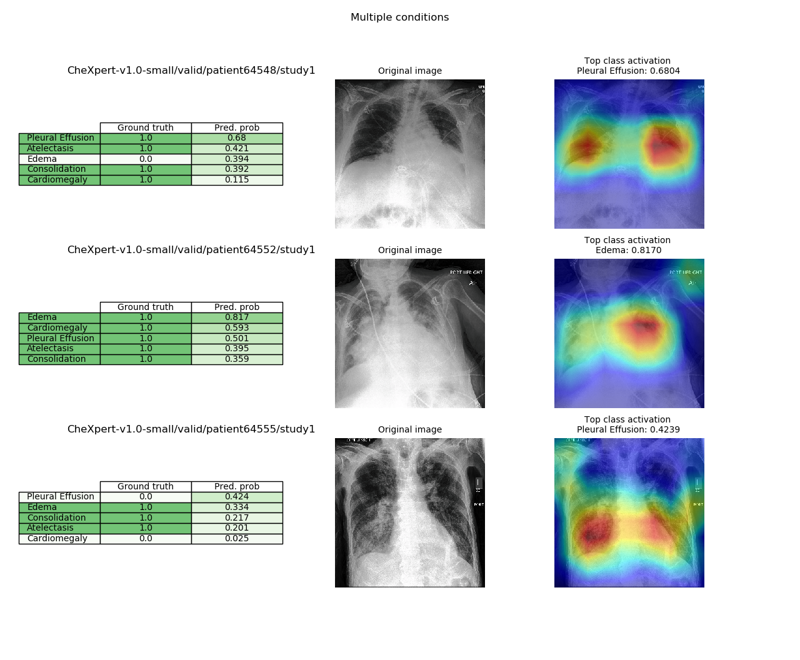

# CheXpert

Implementation of classification models on the [CheXpert dataset](https://stanfordmlgroup.github.io/competitions/chexpert/) aiming to replicate the results in [CheXpert: A Large Chest Radiograph Dataset with Uncertainty Labels and Expert Comparison](https://arxiv.org/abs/1901.07031).

### Usage

To train a model using default batch size, learning:
```
python chexpert.py  --train
                    --data_path         # location of dataset
                    --model             # choice of densenet121 or resnet152 or efficientnet-b[0-7]
                    --pretrained        # flag if pretrained model should be downloaded (only for densenet and resnet)
                    --cuda              # number of cuda device to train on
```

To evaluate a single model:
```
python chexpert.py  --evaluate_single_model / evaluate_ensemble
                    --model             # architecture of the saved model
                    --data_path         # location of dataset
                    --output_dir        # folder where experiment results and tensorboard tracking are saved
                    --restore           # if evaluate_single_model - file path to the saved model checkpoint,
                                          if evaluate_ensemble - folder path to the directory where checkpoints are saved
                    --plot_roc          # flag whether to also plot ROC and PR curves
```

To visualize class activation mappings from the validation set (saves a grid of model probabilities, original image, and grad-cam visualization for 3 examples for each condition singularly present, 2 present conditions, >2 present conditions, and no present conditions; example below):
```
python chexpert.py  --visualize
                    --model             # choice of densenet121 or resnet152 of the saved model
                    --data_path         # location of dataset
                    --output_dir        # folder where experiment results are saved
                    --restore           # file path to the saved model checkpoint
```

### Results

Models were trained with the hyperparameters described in the paper (Training Procedure section). `pretrained` refers to ImageNet pretraining and subsequent fine-tuning of the entire model. `data_aug` refers to data augmentation applying brightness and contrast jitter to the training data. The results below are an ensemble of the 10 best checkpoints on the validation set computing the mean of the output scores over the 10 models.

##### AUCROC scores on the validation set using U-Ones uncertainty labels:

| Model | Atelectasis | Cardiomegaly | Consolidation | Edema | Pleural Effusion |
| --- | --- | --- | --- | --- | --- |
| densenet121_baseline | 0.847 | 0.845	| 0.912 | 0.905 | 0.938 |
| densenet121_pretrained | 0.847 | 0.859 | 0.900 | 0.936 | 0.940 |
| densenet121_pretrained_data_aug | 0.849 | 0.859 | 0.902 |	0.932 | 0.943 |
| efficientnet-b0_data_aug | 0.857 | 0.852 | 0.903 | 0.890 | 0.932 |
| efficientnet-b4_data_aug	| 0.851	| 0.844 | 0.904 | 0.890 | 0.928 |
| resnet152_baseline | 0.861 | 0.852 | 0.908 | 0.894 | 0.919 |
| resnet152_pretrained | 0.849 | 0.859 | 0.916 | 0.934 | 0.944 |


##### ROC and PR plots on the validation set using DenseNet121_pretrained:


##### Examples of findings localization using Gradient-weighted Class Activation Mappings using DenseNet121_pretrained:

In the predictions tables below, `Pred. prob` refers to model prediction probability (uncalibrated).

###### Pleural Effusion only



###### No findings



###### Multiple findings



### Dependencies
* python 3.5+
* pytorch 1.0+
* torchvision
* numpy
* pandas
* sklearn
* matplotlib
* tensorboardX
* tqdm
